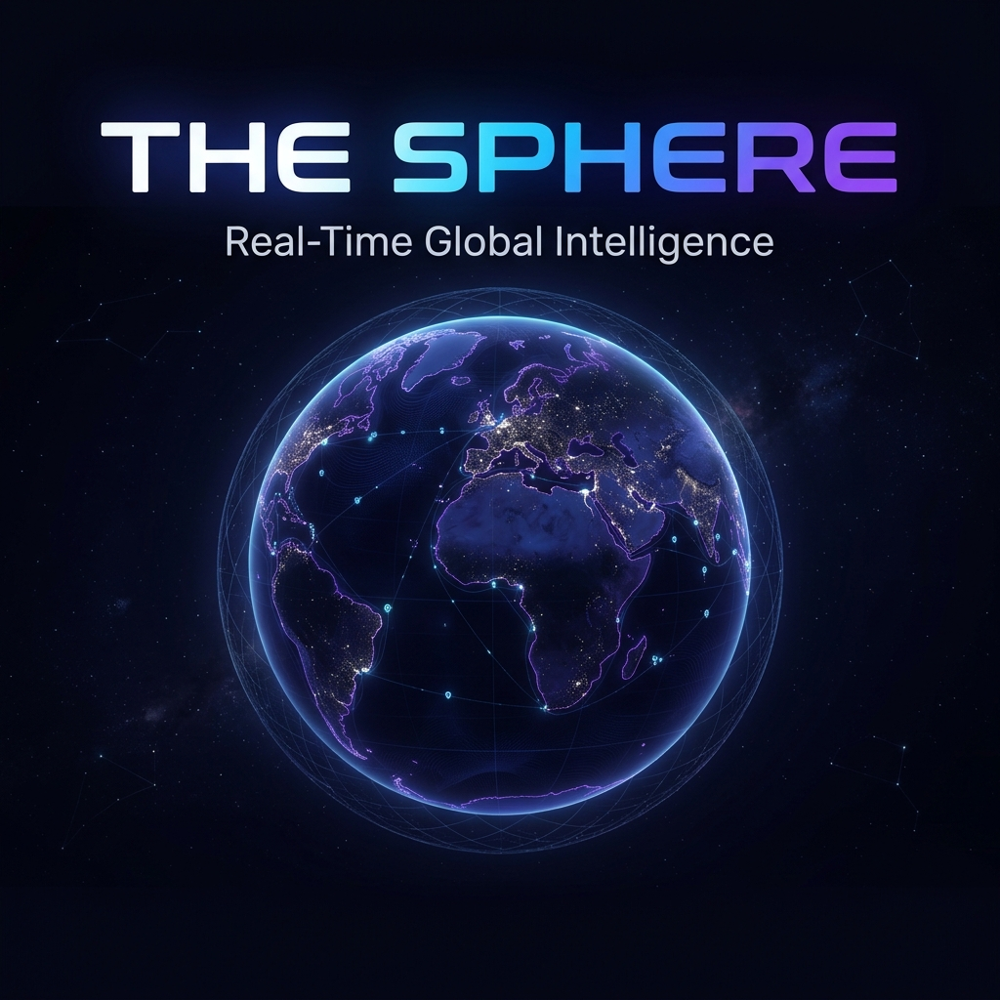

<p align="center">
  
</p>

<p align="center">
  <strong>Interactive 3D globe with real-time country intelligence, live maritime tracking, and dynamic data visualization.</strong>
</p>

<p align="center">
  <a href="#features">Features</a> •
  <a href="#tech-stack">Tech Stack</a> •
  <a href="#getting-started">Getting Started</a> •
  <a href="#deployment">Deployment</a> •
  <a href="#architecture">Architecture</a> •
  <a href="#license">License</a>
</p>

---

## Features

🌍 **Interactive 3D Globe** — Navigate a high-fidelity Earth with Blue Marble textures, bump mapping, and real-time day/night terminator lighting

🔍 **Unified Search** — Search across 197 countries, 5,000+ cities, and live vessels from a single search bar

📊 **Country Intelligence** — Click any country to get real-time weather (OpenWeatherMap), top news (NewsAPI), GDP & statistics (World Bank), and demographic data (REST Countries)

🚢 **Live Maritime Tracking** — Real-time ship positions via AIS (Automatic Identification System) with color-coded vessel categories, heading indicators, and historical route trails

🎯 **Spatial Data Panels** — Country data panels are pinned to the globe position and follow the camera in real-time using `requestAnimationFrame`

🌟 **Premium Landing Screen** — Animated particle network canvas, floating orb with spinning rings, and phased content reveal

🏙️ **City-Level Zoom** — Search for a city and the camera flies directly to its coordinates with a tighter zoom than country-level

🔥 **Global Hotspots** — Animated markers for active conflict zones, weather events, and economic hotspots

## Tech Stack

| Layer | Technology |
|-------|-----------|
| **Frontend** | React 19 · Vite 8 · Zustand |
| **3D Rendering** | react-globe.gl · Three.js |
| **Backend** | Express · Node.js |
| **Real-Time** | AISStream.io (WebSocket) · Server-Sent Events |
| **Data Sources** | OpenWeatherMap · NewsAPI · REST Countries · World Bank · MyShipTracking |
| **Styling** | Vanilla CSS (1,100+ line design system — glassmorphism, spring animations, deep space palette) |
| **Deployment** | Vercel (serverless) |

## Getting Started

### Prerequisites

- **Node.js** ≥ 18
- **npm** ≥ 9

### 1. Clone & Install

```bash
git clone https://github.com/voidutk/THE-SPHERE.git
cd THE-SPHERE
npm install
```

### 2. Configure Environment

```bash
cp .env.example .env
```

Edit `.env` with your API keys:

| Variable | Required | Free Tier | Get it at |
|----------|----------|-----------|-----------|
| `NEWS_API_KEY` | Recommended | ✅ | [newsapi.org](https://newsapi.org) |
| `OPENWEATHER_API_KEY` | Recommended | ✅ | [openweathermap.org/api](https://openweathermap.org/api) |
| `AISSTREAM_API_KEY` | For ships | ✅ | [aisstream.io](https://aisstream.io) |
| `MST_API_KEY` | Optional | Trial | [myshiptracking.com](https://www.myshiptracking.com) |

> **Note:** The app works without any API keys — all providers fall back to mock data so you can explore the full UI immediately.

### 3. Run

```bash
npm run dev
```

This starts both the Vite dev server (`:5173`) and Express API (`:3001`) concurrently.

Open **http://localhost:5173** and click **ENTER THE SPHERE**.

## Deployment

### Vercel (Recommended)

The project is pre-configured for Vercel with `vercel.json`:

1. Push to GitHub
2. Import the repo at [vercel.com/new](https://vercel.com/new)
3. Set **Root Directory** to `.` (project root)
4. Add your API keys as Environment Variables
5. Deploy

The Express API runs as a Vercel serverless function via `api/index.mjs`. Country data, weather, news, and search work perfectly in serverless.

> **Note:** Live ship tracking requires a persistent WebSocket and is only available in local development. The app degrades gracefully on Vercel — everything else works.

## Architecture

```
THE-SPHERE/
├── api/                         # Vercel serverless entry
│   └── index.mjs
├── client/                      # Vite + React SPA
│   ├── public/
│   │   ├── geojson/             # TopoJSON country boundaries
│   │   └── textures/            # Earth textures (Blue Marble, topology)
│   └── src/
│       ├── App.jsx              # Root component
│       ├── index.css             # Full design system
│       ├── components/          # LoadingScreen, SearchBar, Tooltip
│       └── modules/
│           ├── data/            # Zustand stores, static datasets
│           ├── globe/           # GlobeScene, SpatialUI, CountryPoints
│           └── panels/          # ShipPanel
├── server/                      # Express API
│   ├── app.js                   # Express app (shared by dev & serverless)
│   ├── index.js                 # Dev server entry (listen + AIS)
│   ├── aggregator/              # Country data orchestrator
│   │   └── providers/           # Weather, News, Stats providers
│   ├── ais/                     # AIS WebSocket client + ship store
│   ├── cache/                   # In-memory cache with TTL
│   └── routes/                  # REST API endpoints
└── vercel.json                  # Vercel deployment config
```

### Data Flow

```
User clicks country on globe
        ↓
GlobeScene → Zustand Store → GET /api/country/:code
        ↓
Express → Aggregator (Promise.allSettled)
        ↓
   ┌────┼────────────┐
   ↓    ↓            ↓
Weather  News    REST Countries
(OWM)  (NewsAPI)  + World Bank
   ↓    ↓            ↓
   └────┼────────────┘
        ↓
Cache (15min TTL) → Response → SpatialUI panels on globe
```

## API Endpoints

| Method | Endpoint | Description |
|--------|----------|-------------|
| `GET` | `/api/health` | Health check |
| `GET` | `/api/country/:code` | Aggregated country data (weather + news + stats) |
| `GET` | `/api/search?q=` | Country name search via REST Countries |
| `GET` | `/api/ships` | Snapshot of all tracked vessels |
| `GET` | `/api/ships/stream` | SSE stream of live ship updates |
| `GET` | `/api/ships/track/:mmsi` | Historical vessel track |
| `GET` | `/api/ships/details/:mmsi` | Extended vessel information |
| `GET` | `/api/ships/:mmsi` | Single vessel by MMSI |

## License

[MIT](LICENSE)
